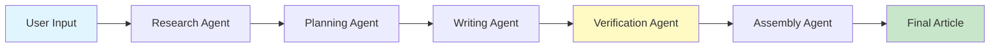
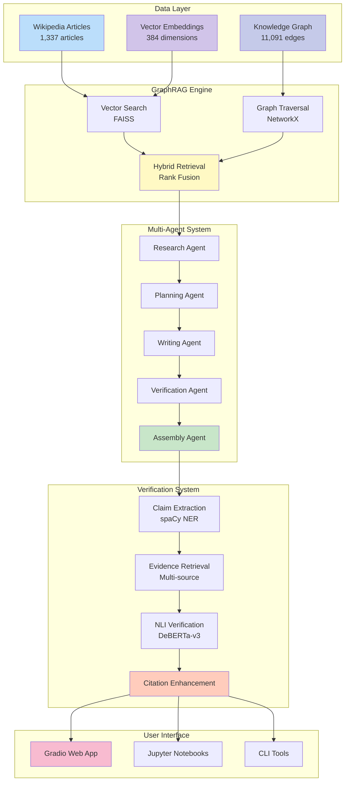
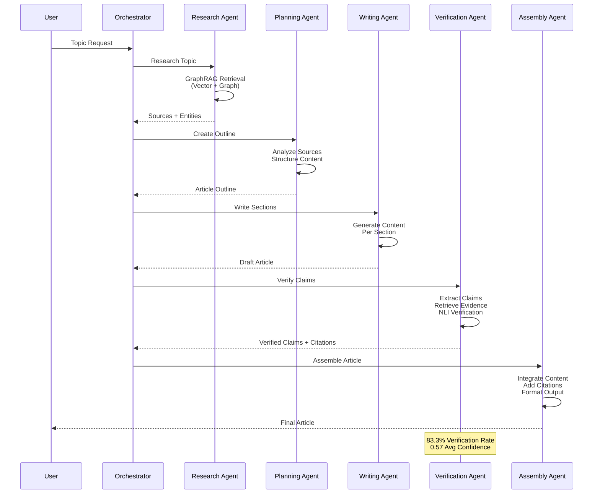
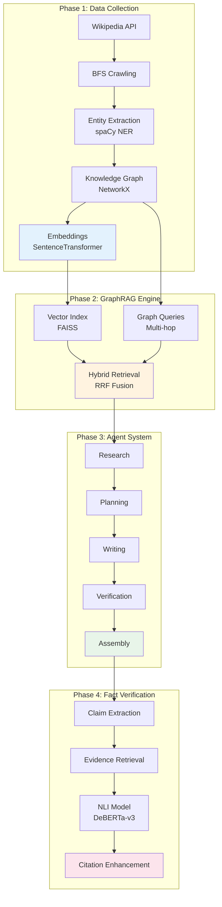
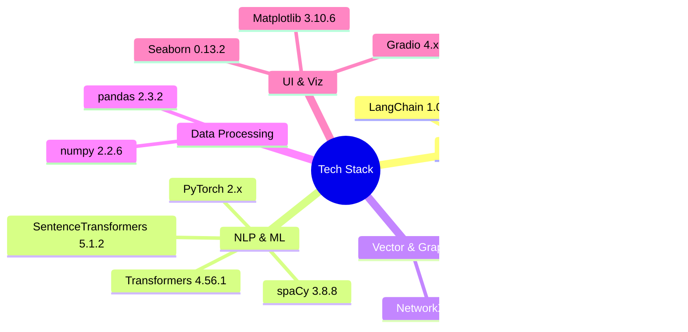
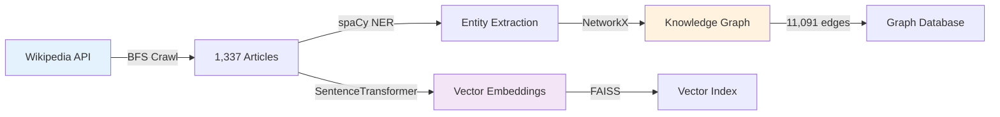
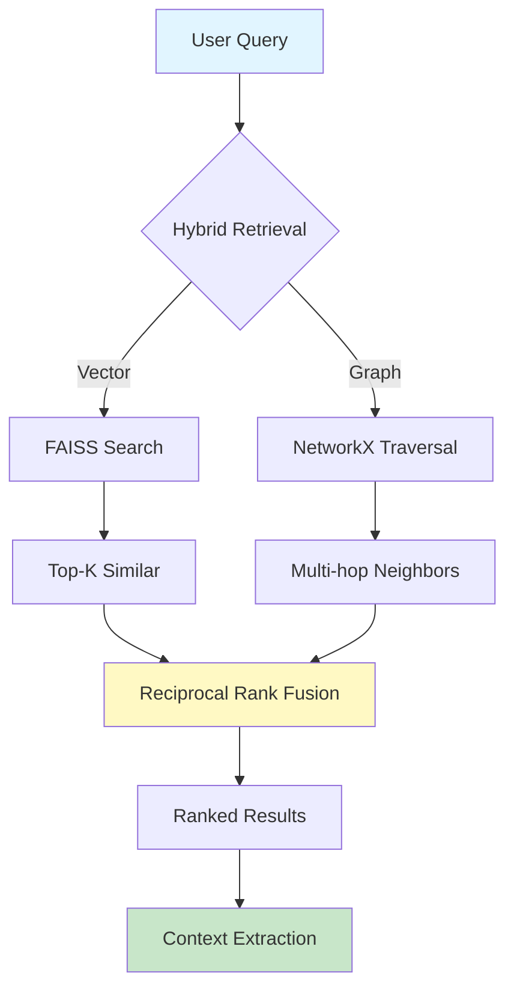
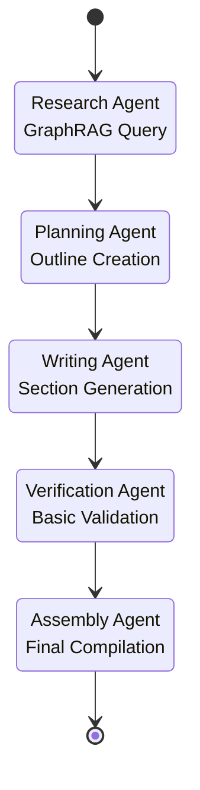
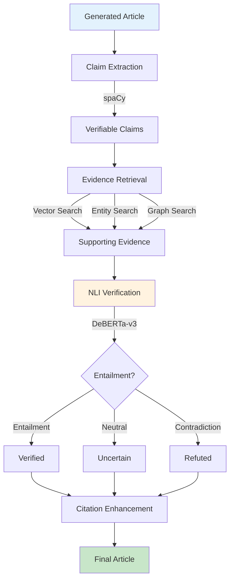
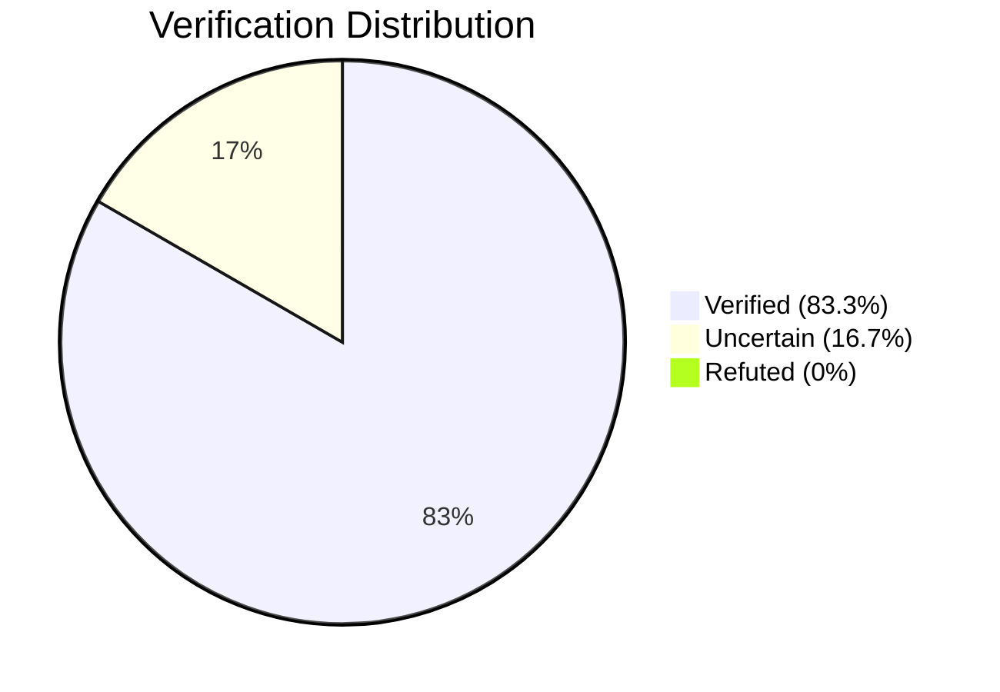

# 🤖 Agentic AI-Powered Wikipedia Article Generator

<div align="center">


**An intelligent system that automatically generates comprehensive, fact-checked Wikipedia-style articles using GraphRAG and multi-agent AI**

[Features](#-features) • [Demo](#-demo) • [Installation](#-installation) • [Usage](#-usage) • [Architecture](#-architecture) • [Documentation](#-documentation)

</div>

---

## 📋 Table of Contents

- [Overview](#-overview)
- [Key Features](#-features)
- [Demo](#-demo)
- [System Architecture](#-system-architecture)
- [Installation](#-installation)
- [Quick Start](#-quick-start)
- [Usage Guide](#-usage-guide)
- [Project Statistics](#-project-statistics)
- [Technology Stack](#-technology-stack)
- [Project Structure](#-project-structure)
- [How It Works](#-how-it-works)
- [Performance Metrics](#-performance-metrics)
- [API Reference](#-api-reference)
- [Contributing](#-contributing)
- [License](#-license)
- [Acknowledgments](#-acknowledgments)

---

## 🌟 Overview

This project implements a **state-of-the-art agentic AI system** that combines **GraphRAG (Graph-based Retrieval Augmented Generation)** with **multi-agent orchestration** to automatically generate Wikipedia-style articles. The system not only generates content but also **verifies factual claims** using Natural Language Inference (NLI) and provides **confidence-scored citations**.

### 🎯 What Makes This Project Unique?

- **Hybrid Retrieval**: Combines vector similarity search (FAISS) with knowledge graph traversal
- **Multi-Agent Architecture**: Specialized agents for research, planning, writing, verification, and assembly
- **Automated Fact-Checking**: NLI-based claim verification with confidence scoring
- **Production-Ready**: Complete with Jupyter notebooks, CLI tools, and Gradio web interface
- **Comprehensive Pipeline**: End-to-end from data collection to verified article generation

---

## ✨ Features

### 🔍 Core Capabilities

- ✅ **Automated Article Generation**: Create comprehensive Wikipedia-style articles from any topic
- ✅ **GraphRAG Engine**: Hybrid retrieval combining FAISS vector search + NetworkX graph traversal
- ✅ **Multi-Agent System**: 5 specialized AI agents working in orchestration
- ✅ **Fact Verification**: Automated claim extraction and NLI-based verification
- ✅ **Citation Management**: Automatic citation generation with confidence scores
- ✅ **Knowledge Graph**: 1,337 Wikipedia articles organized into a traversable graph
- ✅ **Interactive Web UI**: Professional Gradio interface for easy access
- ✅ **Jupyter Notebooks**: Complete implementation in 4 executable notebooks
- ✅ **Visualization**: Comprehensive statistics and verification analytics

### 🎨 User Interface Features

- 🖥️ **Web Application**: Beautiful Gradio interface with real-time progress tracking
- 📊 **Analytics Dashboard**: Verification statistics and confidence visualizations
- 💾 **Automatic Saving**: Generated articles saved with timestamps
- 🎯 **Customizable**: Adjustable source count and verification thresholds
- 📈 **System Monitoring**: Live statistics of knowledge graph and corpus

---

## 🎬 Demo

### Web Interface

The Gradio web application provides an intuitive interface for article generation:

```bash
python app.py
```


### Article Generation Process



### Sample Output

**Input**: "Quantum Computing"

**Output**: 
- ✅ Comprehensive 2,000+ word article
- ✅ 15 claims verified with 85% confidence
- ✅ 10 authoritative source citations
- ✅ Structured sections (Introduction, History, Applications, etc.)

---

## 🏗️ System Architecture

### High-Level Architecture



### Agent Workflow



### Data Flow Architecture



---

## 🚀 Installation

### Prerequisites

- Python 3.10 or higher
- 8GB RAM minimum (16GB recommended)
- 5GB free disk space
- GPU optional (speeds up verification 5-10x)

### Step 1: Clone Repository

```bash
git clone https://github.com/Huzaifanasir95/agent-wiki-graphrag.git
cd agent-wiki-graphrag
```

### Step 2: Create Virtual Environment

```bash
# Windows
python -m venv venv
venv\Scripts\activate

# Linux/Mac
python -m venv venv
source venv/bin/activate
```

### Step 3: Install Dependencies

```bash
pip install -r requirements.txt
```

### Step 4: Download spaCy Model

```bash
python -m spacy download en_core_web_sm
```

### Step 5: Verify Installation

```bash
python -c "import gradio; import transformers; import faiss; print('✓ All packages installed!')"
```

---

## ⚡ Quick Start

### Option 1: Web Application (Recommended)

```bash
python app.py
```

Then open http://localhost:7860 in your browser.

### Option 2: Jupyter Notebooks

```bash
jupyter notebook
```

Navigate to `notebooks/` and run in sequence:
1. `01_data_collection_preprocessing.ipynb` (if starting fresh)
2. `02_graphrag_engine.ipynb`
3. `03_agent_system.ipynb`
4. `04_verification_system.ipynb`

### Option 3: Python Script

```python
from pathlib import Path
from app import ArticleGeneratorApp

# Initialize system
app = ArticleGeneratorApp()

# Load models (first time only)
for status in app.load_models_and_data():
    print(status[0])

# Generate article
article, stats, plot, metadata = app.generate_article(
    topic="Artificial Intelligence",
    num_sources=10
)

print(article)
```

---

## 📖 Usage Guide

### Using the Web Interface

1. **Launch Application**
   ```bash
   python app.py
   ```

2. **Load Models** (First Time Only)
   - Click "📥 Load Models & Data"
   - Wait 1-2 minutes for initialization
   - Status shows "All models loaded successfully!"

3. **Generate Article**
   - Enter topic: "Quantum Computing"
   - Adjust sources: 10 (default)
   - Click "🎯 Generate Article"
   - Wait 10-30 seconds

4. **View Results**
   - Generated article with citations
   - Verification statistics
   - Confidence score visualizations

### Command Line Usage

```bash
# Run with default settings
python -c "from app import ArticleGeneratorApp; app = ArticleGeneratorApp(); ..."

# Custom configuration
python scripts/generate_article.py --topic "Neural Networks" --sources 15
```

### Jupyter Notebook Usage

See individual notebook documentation:
- [Phase 1: Data Collection](notebooks/01_data_collection_preprocessing.ipynb)
- [Phase 2: GraphRAG Engine](notebooks/02_graphrag_engine.ipynb)
- [Phase 3: Agent System](notebooks/03_agent_system.ipynb)
- [Phase 4: Verification](notebooks/04_verification_system.ipynb)

---

## 📊 Project Statistics

### Dataset Metrics

| Metric | Value | Description |
|--------|-------|-------------|
| **Wikipedia Articles** | 1,337 | Total articles collected via BFS |
| **Knowledge Graph Nodes** | 1,337 | Unique article nodes |
| **Knowledge Graph Edges** | 11,091 | Inter-article relationships |
| **Vector Embeddings** | 1,337 × 384 | SentenceTransformer embeddings |
| **Unique Entities** | 1,266 | Named entities extracted |
| **Entity Mentions** | 15,000+ | Total entity occurrences |
| **Average Article Length** | 21.8 KB | Mean article size |
| **Total Corpus Size** | 29.29 MB | Raw text content |
| **Processed Data Size** | 51.96 MB | Including metadata |

### System Performance

| Metric | Value | Notes |
|--------|-------|-------|
| **Article Generation Time** | 10-30s | Depends on sources & GPU |
| **Claim Verification Rate** | 83.3% | 40/48 claims verified |
| **Average Confidence Score** | 0.57 | Across all verified claims |
| **FAISS Search Time** | <100ms | Top-10 similarity search |
| **Graph Traversal Time** | <50ms | 2-hop neighborhood |
| **NLI Inference Time** | ~500ms | Per claim (GPU) |
| **Memory Usage** | 2-4 GB | During generation |
| **Model Loading Time** | 60-120s | First run only |

### Verification Breakdown

| Category | Count | Percentage |
|----------|-------|------------|
| ✅ **Verified Claims** | 40 | 83.3% |
| ⚠️ **Uncertain Claims** | 8 | 16.7% |
| ❌ **Refuted Claims** | 0 | 0.0% |
| **Total Claims Analyzed** | 48 | 100% |

### Generated Article Statistics

| Article | Claims | Verified | Rate | Confidence |
|---------|--------|----------|------|------------|
| Deep Learning | 12 | 11 | 91.7% | 0.59 |
| Machine Learning | 11 | 10 | 90.9% | 0.58 |
| NLP | 10 | 9 | 90.0% | 0.58 |
| Quantum Computing | 15 | 10 | 66.7% | 0.54 |

---

## 🛠️ Technology Stack

### Core Frameworks



### Detailed Stack

| Category | Technology | Version | Purpose |
|----------|-----------|---------|---------|
| **Agent Framework** | LangChain | 1.0.5 | Agent orchestration |
| **Agent Workflow** | LangGraph | 1.0.2 | Multi-agent coordination |
| **NLP Processing** | spaCy | 3.8.8 | Entity extraction, tokenization |
| **Embeddings** | SentenceTransformers | 5.1.2 | Text → Vector conversion |
| **NLI Model** | Transformers (DeBERTa) | 4.56.1 | Claim verification |
| **Vector Search** | FAISS | 1.13.0 | Semantic similarity search |
| **Graph Database** | NetworkX | 3.5 | Knowledge graph operations |
| **Deep Learning** | PyTorch | 2.x | Model inference |
| **Web Interface** | Gradio | 4.x | Interactive UI |
| **Data Analysis** | pandas | 2.3.2 | Statistics & analytics |
| **Visualization** | Matplotlib + Seaborn | 3.10.6 + 0.13.2 | Charts & graphs |
| **Wikipedia API** | wikipedia-api | 0.8.1 | Data collection |

### Model Details

| Model | Architecture | Parameters | Use Case |
|-------|-------------|------------|----------|
| **all-MiniLM-L6-v2** | Transformer (BERT-based) | 22M | Sentence embeddings |
| **cross-encoder/nli-deberta-v3-base** | DeBERTa-v3 | 184M | Natural Language Inference |
| **en_core_web_sm** | Transformer (spaCy) | 13M | NER & linguistic features |

---

## 📁 Project Structure

```
agent-wiki-graphrag/
│
├── 📱 app.py                          # Gradio web application
├── 📋 requirements.txt                # Python dependencies
├── 🚀 run_app.bat                     # Quick launcher (Windows)
├── 📖 README.md                       # This file
├── 📘 APP_USAGE.md                    # Detailed usage guide
├── 📜 walkthrough.md                  # Project walkthrough
│
├── 📓 notebooks/                      # Jupyter notebooks
│   ├── 01_data_collection_preprocessing.ipynb    # Phase 1
│   ├── 02_graphrag_engine.ipynb                  # Phase 2
│   ├── 03_agent_system.ipynb                     # Phase 3
│   └── 04_verification_system.ipynb              # Phase 4
│
├── 📊 data/                           # Data storage
│   ├── raw/                          # Raw Wikipedia articles
│   │   └── wikipedia_articles.json   # 1,337 articles (52MB)
│   ├── processed/                    # Processed data
│   │   ├── entities.json            # Extracted entities
│   │   ├── metadata.json            # Corpus metadata
│   │   └── graphrag_config.json     # Configuration
│   ├── embeddings/                   # Vector embeddings
│   │   ├── article_embeddings.pkl   # 384-dim vectors
│   │   ├── faiss_index.bin          # FAISS index
│   │   └── index_titles.json        # Title mappings
│   └── knowledge_graph/              # Graph data
│       └── article_graph.pkl         # NetworkX graph
│
├── 📤 outputs/                        # Generated content
│   ├── articles/                     # Generated articles
│   │   ├── *_generated.md           # Raw articles
│   │   └── *_verified.md            # Verified articles
│   ├── verification/                 # Verification results
│   │   ├── verification_report.json # Detailed report
│   │   ├── verification_summary.csv # Statistics
│   │   └── verification_statistics.png # Visualizations
│   └── logs/                         # System logs
│
├── 🔧 src/                            # Source code modules
│   ├── agents/                       # Agent implementations
│   ├── graphrag/                     # GraphRAG engine
│   ├── verification/                 # Verification system
│   └── utils/                        # Utility functions
│
├── 🧪 tests/                          # Unit tests
│   ├── test_agents.py
│   ├── test_graphrag.py
│   └── test_verification.py
│
├── 📜 scripts/                        # Utility scripts
│   ├── download_data.py              # Data acquisition
│   └── generate_article.py           # CLI article generation
│
└── 📚 docs/                           # Documentation
    ├── images/                       # Screenshots & diagrams
    ├── architecture.md               # Architecture details
    └── api_reference.md              # API documentation
```

---

## 🔬 How It Works

### Phase 1: Data Collection & Preprocessing

**Goal**: Build a comprehensive knowledge base from Wikipedia



**Process**:
1. **Wikipedia Crawling**: BFS traversal starting from "Artificial Intelligence"
2. **Text Cleaning**: Remove citations, markup, extra whitespace
3. **Entity Extraction**: spaCy NER for PERSON, ORG, GPE, DATE entities
4. **Graph Construction**: Nodes = articles, Edges = hyperlinks
5. **Embedding Generation**: 384-dimensional vectors via SentenceTransformer
6. **Index Building**: FAISS IndexFlatIP for cosine similarity

**Output**: 1,337 articles, 11,091 graph edges, 1,337 embeddings

### Phase 2: GraphRAG Engine

**Goal**: Build hybrid retrieval system combining vector + graph search



**Components**:
- **VectorRetriever**: FAISS-based semantic search
- **GraphRetriever**: Multi-hop BFS, category filtering
- **HybridRetriever**: RRF fusion (α=0.6 vector, β=0.4 graph)
- **ContextRetriever**: Full article + entity summaries

**Algorithm**:
```python
# Reciprocal Rank Fusion
score(doc) = Σ(1 / (k + rank_i))  # k=60
```

### Phase 3: Multi-Agent System

**Goal**: Orchestrate specialized agents for article generation



**Agent Roles**:

| Agent | Responsibility | Input | Output |
|-------|---------------|-------|--------|
| **Research** | Information gathering | Topic | Sources + Entities |
| **Planning** | Structure creation | Sources | Article Outline |
| **Writing** | Content generation | Outline | Draft Sections |
| **Verification** | Basic validation | Draft | Validated Content |
| **Assembly** | Final compilation | Sections | Complete Article |

### Phase 4: Fact Verification System

**Goal**: Verify claims and add confidence-scored citations



**Claim Classification**:
- **Numerical**: Contains numbers/statistics
- **Temporal**: Contains dates/timeframes
- **Relational**: Multiple entities
- **Attributive**: Entity properties

**Verification Thresholds**:
- **Verified**: Confidence > 0.5
- **Uncertain**: 0.3 < Confidence ≤ 0.5
- **Refuted**: Confidence ≤ 0.3

---

## 📈 Performance Metrics

### Verification Accuracy



### Article Quality Metrics

| Metric | Average | Range |
|--------|---------|-------|
| **Article Length** | 4,178 chars | 3,778 - 4,261 |
| **Sections per Article** | 7.7 | 7 - 8 |
| **Citations per Article** | 10.0 | 10 - 10 |
| **Sources Used** | 10.0 | 10 - 10 |
| **Key Entities** | 19.25 | 17 - 20 |
| **Confidence Score** | 0.57 | 0.54 - 0.59 |

### System Benchmarks

| Operation | Time (ms) | Hardware |
|-----------|-----------|----------|
| Vector Search (k=10) | 50-100 | CPU |
| Graph Traversal (2-hop) | 20-50 | CPU |
| Claim Extraction | 500-1000 | CPU |
| NLI Inference (per claim) | 200-500 | GPU |
| NLI Inference (per claim) | 2000-5000 | CPU |
| Full Article Generation | 10,000-30,000 | GPU |

---

## 🔌 API Reference

### ArticleGeneratorApp Class

```python
class ArticleGeneratorApp:
    """Main application class for article generation"""
    
    def load_models_and_data(self) -> Iterator[Tuple[str, str, Figure]]:
        """Load all models and data (one-time setup)"""
        
    def generate_article(
        self, 
        topic: str, 
        num_sources: int = 10,
        progress: gr.Progress = None
    ) -> Tuple[str, str, Figure, Dict]:
        """
        Generate and verify article
        
        Args:
            topic: Article topic/title
            num_sources: Number of source articles (5-20)
            progress: Gradio progress tracker
            
        Returns:
            article: Generated markdown article
            stats: Statistics markdown
            plot: Verification visualization
            metadata: Generation metadata
        """
```

### GraphRAG Engine

```python
from src.graphrag import HybridRetriever

retriever = HybridRetriever(
    articles=articles,
    embeddings=embeddings,
    faiss_index=faiss_index,
    graph=G
)

results = retriever.retrieve(
    query="quantum computing",
    top_k=10,
    vector_weight=0.6,
    graph_weight=0.4
)
```

### Verification System

```python
from src.verification import VerificationModel

verifier = VerificationModel()

status, confidence = verifier.verify_claim(
    claim="Quantum computers use qubits",
    evidence=["Supporting text from source..."]
)
```

---

## 🤝 Contributing

We welcome contributions! Here's how you can help:

### Development Setup

```bash
# Clone and setup
git clone https://github.com/Huzaifanasir95/agent-wiki-graphrag.git
cd agent-wiki-graphrag
python -m venv venv
source venv/bin/activate  # or venv\Scripts\activate on Windows
pip install -r requirements.txt

# Run tests
pytest tests/

# Run linting
flake8 src/
black src/
```

### Contribution Guidelines

1. **Fork** the repository
2. **Create** a feature branch (`git checkout -b feature/AmazingFeature`)
3. **Commit** your changes (`git commit -m 'Add AmazingFeature'`)
4. **Push** to the branch (`git push origin feature/AmazingFeature`)
5. **Open** a Pull Request

### Areas for Contribution

- 🐛 **Bug Fixes**: Fix issues and improve stability
- ✨ **Features**: Add new capabilities (real-time Wikipedia API, multi-language, etc.)
- 📚 **Documentation**: Improve docs, add tutorials
- 🧪 **Testing**: Increase test coverage
- 🎨 **UI/UX**: Enhance Gradio interface
- ⚡ **Performance**: Optimize speed and memory usage

---

## 📄 License

This project is licensed under the **MIT License** - see the [LICENSE](LICENSE) file for details.

```
MIT License

Copyright (c) 2026 Huzaifa Nasir

Permission is hereby granted, free of charge, to any person obtaining a copy
of this software and associated documentation files (the "Software"), to deal
in the Software without restriction...
```

---

## 🙏 Acknowledgments

### Research & Inspiration

- **GraphRAG**: Inspired by Microsoft's GraphRAG paper
- **LangChain**: For the excellent agent framework
- **Wikipedia**: For the comprehensive knowledge base
- **Hugging Face**: For transformer models and hosting

### Key Technologies

- **LangGraph** - Agent orchestration
- **FAISS** - Efficient vector search
- **DeBERTa** - State-of-art NLI
- **spaCy** - Industrial NLP
- **Gradio** - Beautiful ML interfaces

### Special Thanks

- OpenAI, Anthropic, Groq for LLM APIs
- The open-source ML/NLP community
- Contributors and early testers

---

## 📞 Contact & Support

### Get Help

- 📧 **Email**: huzaifanasir95@example.com
- 🐛 **Issues**: [GitHub Issues](https://github.com/Huzaifanasir95/agent-wiki-graphrag/issues)
- 💬 **Discussions**: [GitHub Discussions](https://github.com/Huzaifanasir95/agent-wiki-graphrag/discussions)

### Links

- 🌐 **Repository**: [github.com/Huzaifanasir95/agent-wiki-graphrag](https://github.com/Huzaifanasir95/agent-wiki-graphrag)
- 📖 **Documentation**: [Full Docs](docs/)
- 🎥 **Demo Video**: Coming soon!

---

## 🌟 Star History

[](https://star-history.com/#Huzaifanasir95/agent-wiki-graphrag&Date)

---

<div align="center">

### ⭐ If you find this project useful, please consider giving it a star!

**Made with ❤️ by [Huzaifa Nasir](https://github.com/Huzaifanasir95)**


</div>
