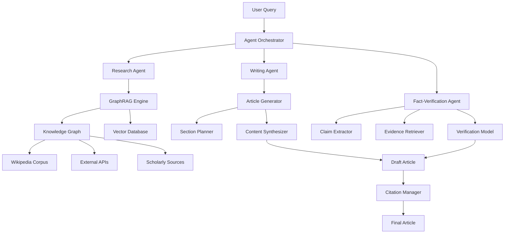
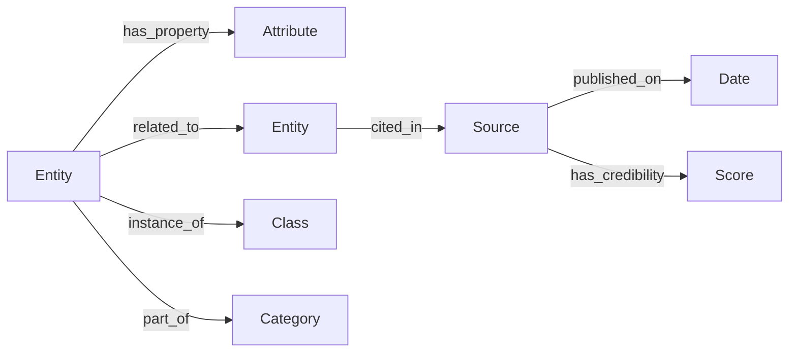
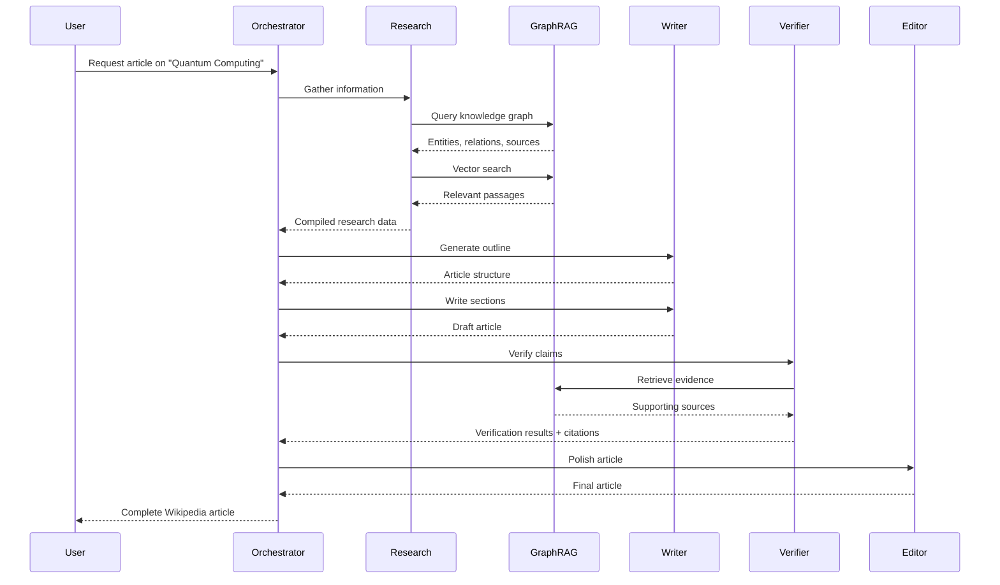
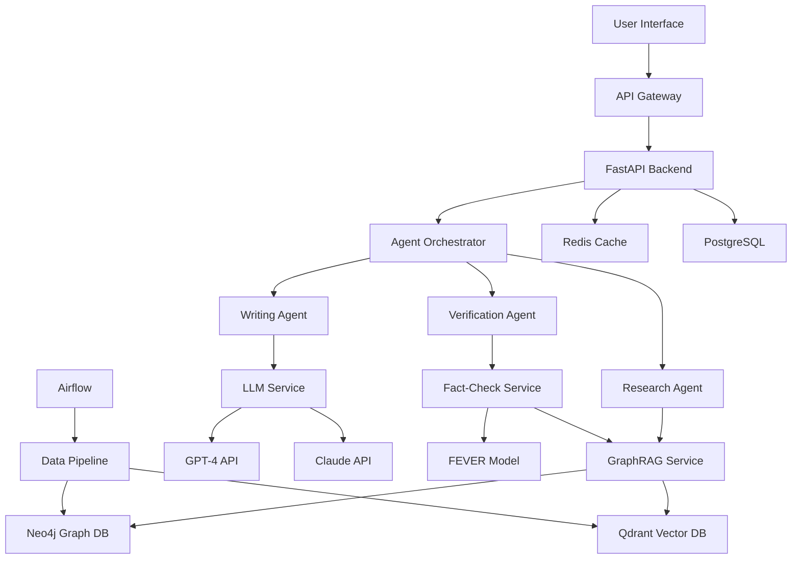

# Agentic AI-Powered Wikipedia Article Generator with GraphRAG & Fact-Verification

## Project Overview

This project implements an intelligent system that automatically generates comprehensive, factually accurate Wikipedia-style articles using a combination of **Agentic AI**, **GraphRAG (Graph-based Retrieval Augmented Generation)**, and **automated fact-verification**. The system leverages knowledge graphs, multi-source data retrieval, and LLM-based agents to create well-structured, citation-backed articles.

---

## Table of Contents

1. [System Architecture](#system-architecture)
2. [Core Components](#core-components)
3. [Data Sources & Knowledge Base](#data-sources--knowledge-base)
4. [Implementation Phases](#implementation-phases)
5. [Technical Stack](#technical-stack)
6. [Detailed Component Breakdown](#detailed-component-breakdown)
7. [Workflow & Data Flow](#workflow--data-flow)
8. [Evaluation & Quality Metrics](#evaluation--quality-metrics)
9. [Deployment Strategy](#deployment-strategy)

---

## System Architecture



---

## Core Components

### 1. **Agentic AI System**
The system uses multiple specialized AI agents that collaborate to complete the article generation task:

- **Research Agent**: Gathers information from multiple sources
- **Planning Agent**: Creates article outline and structure
- **Writing Agent**: Generates coherent content sections
- **Fact-Verification Agent**: Validates claims and adds citations
- **Editing Agent**: Refines style, grammar, and coherence

### 2. **GraphRAG Engine**
Combines graph-based knowledge representation with retrieval-augmented generation:

- **Knowledge Graph Construction**: Entities, relationships, and attributes
- **Graph Traversal**: Multi-hop reasoning for comprehensive information
- **Vector Embeddings**: Semantic search across graph nodes
- **Hybrid Retrieval**: Combines graph queries with vector similarity

### 3. **Fact-Verification System**
Ensures factual accuracy through multi-stage verification:

- **Claim Extraction**: Identifies verifiable statements
- **Evidence Retrieval**: Finds supporting/contradicting sources
- **Verification Scoring**: Assigns confidence scores to claims
- **Citation Generation**: Links claims to authoritative sources

---

## Data Sources & Knowledge Base

### Primary Data Sources

#### 1. **Wikipedia Dumps**
- **Source**: [Wikimedia Downloads](https://dumps.wikimedia.org/)
- **Format**: XML dumps (latest-pages-articles.xml.bz2)
- **Size**: ~20GB compressed, ~90GB uncompressed (English Wikipedia)
- **Update Frequency**: Monthly snapshots
- **Usage**: Base knowledge graph, training data, style reference

#### 2. **Wikidata**
- **Source**: [Wikidata JSON Dumps](https://www.wikidata.org/wiki/Wikidata:Database_download)
- **Format**: JSON
- **Content**: Structured data, entity relationships, properties
- **Usage**: Knowledge graph enrichment, entity linking

#### 3. **DBpedia**
- **Source**: [DBpedia Datasets](https://www.dbpedia.org/resources/download/)
- **Format**: RDF triples, N-Triples
- **Content**: Structured information extracted from Wikipedia
- **Usage**: Ontology mapping, relationship extraction

#### 4. **Scholarly Sources**
- **Semantic Scholar API**: Academic papers and citations
- **arXiv API**: Scientific preprints
- **PubMed**: Medical and life sciences literature
- **Google Scholar** (via SerpAPI): Citation verification

#### 5. **News & Current Events**
- **NewsAPI**: Recent news articles
- **Common Crawl**: Web-scale text data
- **Reddit API**: Community discussions and emerging topics

### Knowledge Graph Schema



---

## Implementation Phases

### Phase 1: Data Collection & Preprocessing (Weeks 1-2)

#### Tasks:
1. **Download Wikipedia Dumps**
   ```bash
   wget https://dumps.wikimedia.org/enwiki/latest/enwiki-latest-pages-articles.xml.bz2
   ```

2. **Parse Wikipedia XML**
   - Extract articles, infoboxes, categories
   - Clean wikitext markup
   - Extract internal links and citations

3. **Build Initial Knowledge Graph**
   - Entity extraction using spaCy/Stanza
   - Relationship extraction using OpenIE
   - Store in Neo4j/ArangoDB

4. **Create Vector Embeddings**
   - Generate embeddings using sentence-transformers
   - Store in FAISS/Milvus/Qdrant
   - Index for fast retrieval

### Phase 2: GraphRAG Development (Weeks 3-4)

#### Tasks:
1. **Graph Database Setup**
   - Schema design for entities, relations, sources
   - Import Wikipedia knowledge graph
   - Create graph indices for traversal

2. **Hybrid Retrieval System**
   - Implement graph query engine (Cypher/AQL)
   - Vector similarity search
   - Fusion ranking algorithm

3. **Multi-hop Reasoning**
   - Path finding algorithms (BFS, DFS)
   - Subgraph extraction for topics
   - Relationship inference

### Phase 3: Agentic AI Implementation (Weeks 5-6)

#### Tasks:
1. **Agent Framework Setup**
   - Use LangGraph/AutoGen/CrewAI
   - Define agent roles and capabilities
   - Implement inter-agent communication

2. **Research Agent**
   ```python
   class ResearchAgent:
       def gather_information(self, topic):
           # Query GraphRAG
           # Search external APIs
           # Aggregate findings
           pass
   ```

3. **Writing Agent**
   - Section generation with LLM (GPT-4/Claude)
   - Coherence checking
   - Style matching (Wikipedia tone)

4. **Planning Agent**
   - Outline generation based on topic
   - Section prioritization
   - Content gap identification

### Phase 4: Fact-Verification System (Weeks 7-8)

#### Tasks:
1. **Claim Extraction**
   - Parse generated text for factual claims
   - Identify entities and relationships
   - Classify claim types (statistical, historical, etc.)

2. **Evidence Retrieval**
   - Query knowledge graph for supporting evidence
   - Search external databases
   - Retrieve source documents

3. **Verification Model**
   - Fine-tune BERT/RoBERTa for NLI (Natural Language Inference)
   - Use FEVER dataset for training
   - Multi-source evidence aggregation

4. **Citation System**
   - Match claims to sources
   - Generate Wikipedia-style citations
   - Add reference section

### Phase 5: Integration & Testing (Weeks 9-10)

#### Tasks:
1. **End-to-End Pipeline**
   - Connect all components
   - Implement error handling
   - Add logging and monitoring

2. **Quality Evaluation**
   - ROUGE/BLEU scores vs. real Wikipedia articles
   - Fact accuracy metrics
   - Human evaluation

3. **User Interface**
   - Web interface (Streamlit/Gradio)
   - API endpoints (FastAPI)
   - Article preview and editing

---

## Technical Stack

### Core Technologies

| Component | Technology | Purpose |
|-----------|-----------|---------|
| **LLM** | GPT-4, Claude 3.5, Llama 3 | Text generation, reasoning |
| **Agent Framework** | LangGraph, AutoGen | Multi-agent orchestration |
| **Knowledge Graph** | Neo4j, ArangoDB | Graph storage and queries |
| **Vector DB** | FAISS, Qdrant, Milvus | Semantic search |
| **NLP** | spaCy, Stanza, Transformers | Entity extraction, NER |
| **Fact-Checking** | FEVER, BERT-NLI | Claim verification |
| **Backend** | FastAPI, Python 3.10+ | API and services |
| **Frontend** | Streamlit, React | User interface |
| **Orchestration** | Apache Airflow | Pipeline management |

### Python Libraries

```python
# Core dependencies
langchain>=0.1.0
langgraph>=0.0.20
openai>=1.0.0
anthropic>=0.8.0

# Graph & Vector DBs
neo4j>=5.0.0
py2neo>=2021.2.3
faiss-cpu>=1.7.4
qdrant-client>=1.7.0

# NLP & ML
spacy>=3.7.0
sentence-transformers>=2.2.0
transformers>=4.35.0
torch>=2.1.0

# Data Processing
pandas>=2.0.0
numpy>=1.24.0
beautifulsoup4>=4.12.0
mwparserfromhell>=0.6.5

# APIs
wikipedia-api>=0.6.0
requests>=2.31.0
```

---

## Detailed Component Breakdown

### 1. GraphRAG Engine Implementation

#### Knowledge Graph Construction

```python
from py2neo import Graph, Node, Relationship
import spacy

class KnowledgeGraphBuilder:
    def __init__(self, neo4j_uri, user, password):
        self.graph = Graph(neo4j_uri, auth=(user, password))
        self.nlp = spacy.load("en_core_web_trf")
    
    def extract_entities(self, text):
        """Extract named entities from text"""
        doc = self.nlp(text)
        entities = []
        for ent in doc.ents:
            entities.append({
                'text': ent.text,
                'label': ent.label_,
                'start': ent.start_char,
                'end': ent.end_char
            })
        return entities
    
    def create_entity_node(self, entity_name, entity_type):
        """Create entity node in graph"""
        node = Node(entity_type, name=entity_name)
        self.graph.merge(node, entity_type, "name")
        return node
    
    def create_relationship(self, entity1, entity2, rel_type, properties=None):
        """Create relationship between entities"""
        rel = Relationship(entity1, rel_type, entity2)
        if properties:
            rel.update(properties)
        self.graph.merge(rel)
```

#### Hybrid Retrieval System

```python
from sentence_transformers import SentenceTransformer
import faiss
import numpy as np

class HybridRetriever:
    def __init__(self, graph, vector_db_path):
        self.graph = graph
        self.encoder = SentenceTransformer('all-MiniLM-L6-v2')
        self.index = faiss.read_index(vector_db_path)
        
    def graph_query(self, entity, max_hops=2):
        """Multi-hop graph traversal"""
        query = f"""
        MATCH path = (e:Entity {{name: $entity}})-[*1..{max_hops}]-(related)
        RETURN path, related
        LIMIT 50
        """
        results = self.graph.run(query, entity=entity).data()
        return results
    
    def vector_search(self, query, top_k=10):
        """Semantic similarity search"""
        query_vec = self.encoder.encode([query])
        distances, indices = self.index.search(query_vec, top_k)
        return indices[0], distances[0]
    
    def hybrid_retrieve(self, query, alpha=0.5):
        """Combine graph and vector results"""
        # Extract entities from query
        entities = self.extract_entities(query)
        
        # Graph-based retrieval
        graph_results = []
        for entity in entities:
            graph_results.extend(self.graph_query(entity['text']))
        
        # Vector-based retrieval
        vector_indices, vector_scores = self.vector_search(query)
        
        # Fusion ranking
        combined_results = self.rank_fusion(
            graph_results, 
            vector_indices, 
            vector_scores, 
            alpha
        )
        return combined_results
```

### 2. Agentic AI System

#### Agent Orchestrator

```python
from langgraph.graph import StateGraph, END
from typing import TypedDict, List

class ArticleState(TypedDict):
    topic: str
    outline: List[str]
    research_data: dict
    draft_sections: dict
    verified_content: dict
    citations: List[dict]
    final_article: str

class AgentOrchestrator:
    def __init__(self, llm, graphrag):
        self.llm = llm
        self.graphrag = graphrag
        self.workflow = self.build_workflow()
    
    def build_workflow(self):
        """Define agent workflow"""
        workflow = StateGraph(ArticleState)
        
        # Add nodes (agents)
        workflow.add_node("research", self.research_agent)
        workflow.add_node("plan", self.planning_agent)
        workflow.add_node("write", self.writing_agent)
        workflow.add_node("verify", self.verification_agent)
        workflow.add_node("edit", self.editing_agent)
        
        # Define edges (workflow)
        workflow.set_entry_point("research")
        workflow.add_edge("research", "plan")
        workflow.add_edge("plan", "write")
        workflow.add_edge("write", "verify")
        workflow.add_edge("verify", "edit")
        workflow.add_edge("edit", END)
        
        return workflow.compile()
    
    def research_agent(self, state: ArticleState):
        """Gather information using GraphRAG"""
        topic = state['topic']
        research_data = self.graphrag.hybrid_retrieve(topic)
        state['research_data'] = research_data
        return state
    
    def planning_agent(self, state: ArticleState):
        """Create article outline"""
        prompt = f"""
        Create a Wikipedia-style outline for: {state['topic']}
        Based on research: {state['research_data']}
        """
        outline = self.llm.invoke(prompt)
        state['outline'] = outline
        return state
    
    def writing_agent(self, state: ArticleState):
        """Generate article sections"""
        draft_sections = {}
        for section in state['outline']:
            prompt = f"""
            Write Wikipedia section: {section}
            Topic: {state['topic']}
            Context: {state['research_data']}
            """
            content = self.llm.invoke(prompt)
            draft_sections[section] = content
        state['draft_sections'] = draft_sections
        return state
```

### 3. Fact-Verification System

#### Claim Extraction & Verification

```python
from transformers import AutoTokenizer, AutoModelForSequenceClassification
import torch

class FactVerifier:
    def __init__(self, model_name="microsoft/deberta-v3-large-mnli"):
        self.tokenizer = AutoTokenizer.from_pretrained(model_name)
        self.model = AutoModelForSequenceClassification.from_pretrained(model_name)
        
    def extract_claims(self, text):
        """Extract verifiable claims from text"""
        # Use dependency parsing to identify factual statements
        doc = nlp(text)
        claims = []
        
        for sent in doc.sents:
            # Identify sentences with factual patterns
            if self.is_factual_claim(sent):
                claims.append({
                    'text': sent.text,
                    'entities': [ent.text for ent in sent.ents],
                    'start': sent.start_char,
                    'end': sent.end_char
                })
        return claims
    
    def retrieve_evidence(self, claim, graphrag):
        """Find supporting evidence"""
        evidence = graphrag.hybrid_retrieve(claim['text'], top_k=5)
        return evidence
    
    def verify_claim(self, claim, evidence):
        """Verify claim against evidence using NLI"""
        scores = []
        for ev in evidence:
            inputs = self.tokenizer(
                claim['text'], 
                ev['text'], 
                return_tensors="pt",
                truncation=True,
                max_length=512
            )
            
            with torch.no_grad():
                outputs = self.model(**inputs)
                probs = torch.softmax(outputs.logits, dim=1)
                
            # Labels: 0=contradiction, 1=neutral, 2=entailment
            scores.append({
                'evidence': ev,
                'entailment': probs[0][2].item(),
                'contradiction': probs[0][0].item(),
                'neutral': probs[0][1].item()
            })
        
        # Aggregate scores
        avg_entailment = np.mean([s['entailment'] for s in scores])
        verification_status = 'SUPPORTED' if avg_entailment > 0.7 else 'NEEDS_REVIEW'
        
        return {
            'claim': claim,
            'status': verification_status,
            'confidence': avg_entailment,
            'evidence': scores
        }
```

### 4. Citation Management

```python
class CitationManager:
    def __init__(self):
        self.citations = []
        self.citation_map = {}
    
    def add_citation(self, claim, evidence):
        """Add citation for verified claim"""
        citation = {
            'id': len(self.citations) + 1,
            'claim': claim['text'],
            'source': evidence['source'],
            'url': evidence.get('url', ''),
            'title': evidence.get('title', ''),
            'date': evidence.get('date', ''),
            'type': evidence.get('type', 'web')
        }
        self.citations.append(citation)
        self.citation_map[claim['text']] = citation['id']
        return citation['id']
    
    def format_wikipedia_citation(self, citation):
        """Format citation in Wikipedia style"""
        if citation['type'] == 'web':
            return f"{{{{cite web|url={citation['url']}|title={citation['title']}|access-date={citation['date']}}}}}"
        elif citation['type'] == 'journal':
            return f"{{{{cite journal|title={citation['title']}|journal={citation['source']}|date={citation['date']}}}}}"
        return f"[{citation['id']}]"
    
    def generate_references_section(self):
        """Create Wikipedia references section"""
        refs = "== References ==\n{{Reflist}}\n\n"
        for cit in self.citations:
            refs += f"* {self.format_wikipedia_citation(cit)}\n"
        return refs
```

---

## Workflow & Data Flow

### Complete Article Generation Pipeline



---

## Evaluation & Quality Metrics

### 1. Content Quality Metrics

```python
from rouge_score import rouge_scorer
from nltk.translate.bleu_score import sentence_bleu

class ArticleEvaluator:
    def __init__(self):
        self.rouge = rouge_scorer.RougeScorer(['rouge1', 'rouge2', 'rougeL'])
    
    def evaluate_against_wikipedia(self, generated, reference):
        """Compare generated article to real Wikipedia article"""
        # ROUGE scores
        rouge_scores = self.rouge.score(reference, generated)
        
        # BLEU score
        bleu = sentence_bleu([reference.split()], generated.split())
        
        # Structural similarity
        structure_score = self.compare_structure(generated, reference)
        
        return {
            'rouge': rouge_scores,
            'bleu': bleu,
            'structure': structure_score
        }
    
    def fact_accuracy_rate(self, verification_results):
        """Calculate percentage of verified facts"""
        total = len(verification_results)
        supported = sum(1 for v in verification_results if v['status'] == 'SUPPORTED')
        return supported / total if total > 0 else 0
    
    def citation_coverage(self, article, citations):
        """Measure citation density"""
        claims = self.extract_claims(article)
        cited_claims = sum(1 for c in claims if c['text'] in citations)
        return cited_claims / len(claims) if claims else 0
```

### 2. Quality Benchmarks

| Metric | Target | Measurement |
|--------|--------|-------------|
| **Fact Accuracy** | >90% | Verified claims / Total claims |
| **Citation Coverage** | >80% | Cited claims / Factual claims |
| **ROUGE-L** | >0.4 | vs. real Wikipedia articles |
| **Coherence Score** | >0.7 | LLM-based evaluation |
| **Completeness** | >85% | Section coverage vs. outline |

---

## Deployment Strategy

### Architecture Diagram



### Deployment Steps

#### 1. **Local Development**
```bash
# Clone repository
git clone https://github.com/yourusername/agent-wiki-graphrag.git
cd agent-wiki-graphrag

# Setup environment
python -m venv venv
source venv/bin/activate  # Windows: venv\Scripts\activate
pip install -r requirements.txt

# Setup databases
docker-compose up -d neo4j qdrant redis postgres

# Initialize knowledge graph
python scripts/build_knowledge_graph.py

# Run application
uvicorn app.main:app --reload
```

#### 2. **Cloud Deployment (AWS)**
- **Compute**: ECS/EKS for containerized services
- **Graph DB**: Neo4j AuraDB (managed)
- **Vector DB**: Qdrant Cloud or self-hosted on EC2
- **LLM**: OpenAI API / Anthropic API / Bedrock
- **Storage**: S3 for Wikipedia dumps and artifacts
- **Orchestration**: AWS Step Functions or Airflow on MWAA

#### 3. **Monitoring & Logging**
- **Application Monitoring**: Prometheus + Grafana
- **Logging**: ELK Stack (Elasticsearch, Logstash, Kibana)
- **Tracing**: Jaeger for distributed tracing
- **Alerts**: PagerDuty for critical failures

---

## Project Timeline

| Phase | Duration | Deliverables |
|-------|----------|--------------|
| **Phase 1**: Data Collection | 2 weeks | Knowledge graph, vector DB |
| **Phase 2**: GraphRAG | 2 weeks | Hybrid retrieval system |
| **Phase 3**: Agents | 2 weeks | Multi-agent framework |
| **Phase 4**: Verification | 2 weeks | Fact-checking pipeline |
| **Phase 5**: Integration | 2 weeks | End-to-end system, UI |
| **Total** | **10 weeks** | Production-ready system |

---

## Expected Outcomes

### Sample Generated Article Structure

```markdown
# Quantum Computing

**Quantum computing** is a type of computation that harnesses quantum mechanical phenomena...[1]

## History
The field of quantum computing began in the 1980s when physicist Richard Feynman...[2]

## Principles
### Quantum Bits (Qubits)
Unlike classical bits, qubits can exist in superposition...[3]

### Quantum Entanglement
Entanglement allows qubits to be correlated in ways that classical bits cannot...[4]

## Applications
### Cryptography
Quantum computers pose both threats and opportunities for cryptography...[5]

### Drug Discovery
Pharmaceutical companies are exploring quantum computing for molecular simulation...[6]

## References
[1] Nielsen, Michael A.; Chuang, Isaac L. (2010). Quantum Computation and Quantum Information
[2] Feynman, Richard P. (1982). "Simulating physics with computers"
...
```

---

## Conclusion

This project combines cutting-edge AI technologies to create an intelligent article generation system that:

✅ **Leverages GraphRAG** for comprehensive information retrieval  
✅ **Uses multi-agent AI** for specialized task handling  
✅ **Ensures factual accuracy** through automated verification  
✅ **Generates citations** from authoritative sources  
✅ **Produces Wikipedia-quality** articles at scale  

The system can be extended for:
- Multi-language article generation
- Real-time article updates
- Collaborative human-AI editing
- Domain-specific knowledge bases (medical, legal, technical)

---

## Next Steps

1. **Setup Development Environment**
2. **Download Wikipedia Dumps**
3. **Build Initial Knowledge Graph**
4. **Implement GraphRAG Prototype**
5. **Develop First Agent (Research)**
6. **Iterate and Expand**

Ready to start implementation? Let me know which phase you'd like to begin with!
